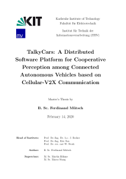
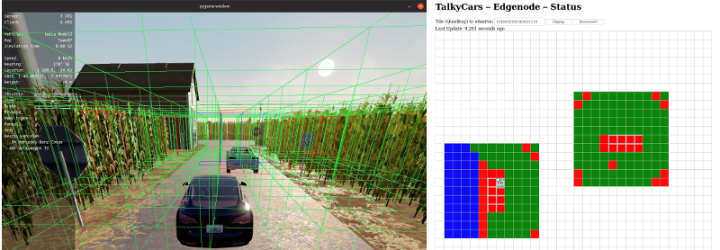
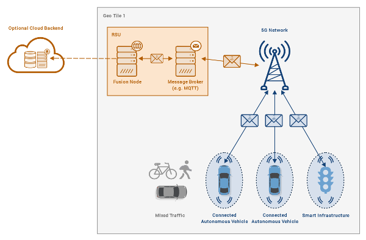
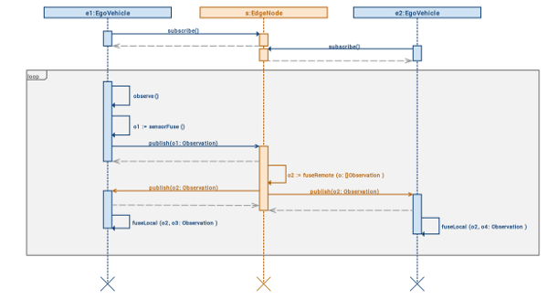

# TalkyCars
**A Distributed Software Platform for Cooperative Perception among Connected Autonomous Vehicles based on Cellular-V2X Communication**

Master Thesis by Ferdinand Mütsch at [ITIV](https://itiv.kit.edu) (Karlsruhe Institute of Technology)

## Abstract


As autonomous vehicles are required to operate among highly mixed traffic during their early market-introduction phase, solely relying on local sensory with limited range is potentially not sufficient to exhaustively perceive and navigate complex urban environments. Addressing this challenge, intelligent vehicles can virtually increase their perception range beyond line-of-sight by utilizing V2X communication with surrounding traffic participants to perform Cooperative Perception. Since existing solutions face a variety of limitations, including lack of comprehensiveness, universality and scalability, this thesis aims to conceptualize, implement and evaluate an end-to-end cooperative perception system using novel techniques. A comprehensive yet extensible modeling approach for dynamic traffic scenes is proposed first, which is based on Probabilistic Entity-Relationship Models, accounts for uncertain environments and combines low-level attributes with high-level relational- and semantic knowledge in a generic way. Second, the design of a holistic, distributed software architecture based on Mobile Edge Computing principles is proposed as a foundation for multi-vehicle high-level sensor fusion. In contrast to most existing approaches, our solution is designed to rely on Cellular-V2X communication in 5G networks and employs geographically distributed fusion nodes as part of a client-server configuration. Our modular proof-of-concept implementation is evaluated in different simulated scenarios to assess the system's performance both qualitatively and quantitatively. Experimental results show that the proposed system scales adequately to meet certain minimum requirements and yields an average improvement in overall perception quality of approximately 27 %.

## Reference
```
@mastersthesis{Mutsch2020,
    author = {M{\"{u}}tsch, Ferdinand},
    school = {Karlsruhe Institute of Technology},
    title = {{TalkyCars: A Distributed Software Platform for Cooperative Perception among Connected Autonomous Vehicles based on Cellular-V2X Communication}},
    year = {2020}
}
```

## Key Concepts & Technologies


* Probabilistic Entity Relationship Models
* Geo tiling using [QuadKeys](https://docs.microsoft.com/en-us/bingmaps/articles/bing-maps-tile-system)
* Occupancy Grids
* C-V2X Communication
* High-level fusion with temporal decay
* Mobile Edge Computing
* [CARLA](https://github.com/carla-simulator/carla) simulator
* MQTT
* Protocol Buffers

## Architecture


## Components


## Sequences


## Requirements
* Python 3.7
  * You might want to use [pyenv](https://github.com/pyenv/pyenv) for version management (see [Common Build Problems](https://github.com/pyenv/pyenv/wiki/Common-build-problems))
* Go 1.13
* [Carla](https://github.com/carla-simulator/carla) 0.9.6
* [Protocol Buffers](https://developers.google.com/protocol-buffers/docs/overview) 3.0.0

## Setup
* `python3 -m venv ./venv`
* `source venv/bin/activate`
* `pip3 install -r requirements.txt`
* `go get ./...`
* `go get -u github.com/golang/protobuf/protoc-gen-go`

## Run
### Preparations
* Set some paths
  * `export PYTHONPATH=$PYTHONPATH:"$('pwd')/src/simulation"`
  * `export PYTHONPATH=$PYTHONPATH:"$('pwd')/carla"`
  * `export PYTHONPATH=$PYTHONPATH:"$('pwd')/carla/dist/carla-0.9.6-py3.7-linux-x86_64.egg"`
* Compile Protobuf schemas: `bash src/script/compile_proto.sh`
* Compile Cython extensions: `cd src/common/quadkey/tilesystem && python3 setup.py build_ext --inplace && cd ../../raycast && python3 setup.py build_ext --inplace && cd ../../..`
* Start Carla: `DISPLAY= ./CarlaUE4.sh -carla-server -windowed -ResX=800 -ResY=600 -opengl`
* Start HiveMQ: `docker run -p 1883:1883 --rm -v config/hivemq.xml:/opt/config.xml skobow/hivemq-ce`
  * If the broker is started on a different machine as any of the other modules, you need to specify `MQTT_BASE_HOSTNAME=<BROKER_IP>` as an environment variable on the machine running the respective module (e.g. `simulation` or `ego`)

### Run Modules (examples)
* Run a **simulation**: `cd src && python3 run.py sim --scene scene1`
* Run the **edge node** (aka. RSU): `cd src && python3 run.py edge --tile 1202032332303131`
* Run a standalone **ego** vehicle: `cd src && python3 run.py ego --rolename dummy --render false --debug true`
  * When running on a different machine as the simulator, add the `--host <HOST_IP>` argument.
* Run the **web** dashboard: `cd src && python3 run.py web`

### Troubleshooting
_**ImportError: libjpeg.so.8: cannot open shared object file**_
* `sudo apt-get install libjpeg-turbo8`

_**ImportError:libpng16.so.16 cannot open shared object file**_
* `sudo apt-get install libpng16-16`


## QuadKey Precision
| Tile Level | Ground Resolution @ Equator (m) |
|------------|---------------------------------|
| 1          | 20037508.352                    |
| 2          | 10018754.176                    |
| 3          | 5009377.088                     |
| 4          | 2504688.544                     |
| 5          | 1252344.272                     |
| 6          | 626172.136                      |
| 7          | 313086.068                      |
| 8          | 156543.034                      |
| 9          | 78271.517                       |
| 10         | 39135.758                       |
| 11         | 19567.879                       |
| 12         | 9783.939                        |
| 13         | 4891.969                        |
| 14         | 2445.984                        |
| 15         | 1222.992                        |
| 16         | 611.496                         |
| 17         | 305.748                         |
| 18         | 152.874                         |
| 19         | 76.437                          |
| 20         | 38.218                          |
| 21         | 19.109                          |
| 22         | 9.554                           |
| 23         | 4.777                           |
| 24         | 2.388                           |
| 25         | 1.194                           |
| 26         | 0.597                           |
| 27         | 0.298                           |
| 28         | 0.149                           |
| 29         | 0.074                           |
| 30         | 0.037                           |
| 31         | 0.018                           |

## Available Cars
See [cars.txt](cars.txt).